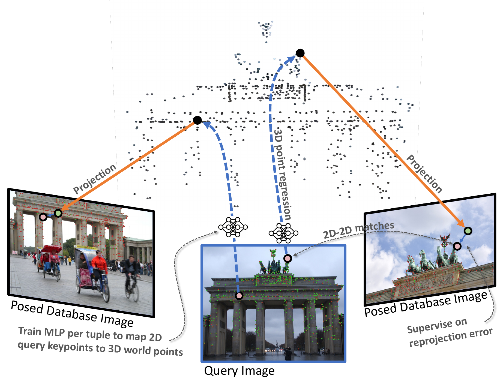

# Sparse–View Localization via Online Neural 3D Regression (CVPR 2026)

<p align="center">
  <a href="https://github.com/LudvigDillen/ON3R">  </a>
  <br /> <strong>Regressing 2D-3D correspondences with ON3R.</strong> ON3R estimates the absolute pose of a query image by comparing it to <em>K</em> posed database images and remains robust even when the database images have little or no mutual overlap (i.e., <em>star-topology</em> data). As input, ON3R takes sparse matches (no visual features) between the query and each database image. For every matched query keypoint, ON3R regresses a 3D point by training a compact MLP on-the-fly, supervised by reprojection errors and a monocular depth prior. The resulting 2D–3D matches are then used to estimate the absolute pose, which, together with the regressed 3D points, is refined with lightweight bundle adjustment.
</p>

[[Paper PDF (coming later with Conference Proceedings)]](link) | [[Project Page]](https://ludvigdillen.github.io/ON3R/)

---
## 🚀 Quickstart

### 1. Clone the repository

```bash
# initialize required submodules (locba, MoGe), keep optional ones (ace, reloc3r, vggt, RoMa) disabled by default
git clone --no-recurse-submodules https://github.com/LudvigDillen/ON3R.git
cd ON3R
git submodule update --init --recursive locba MoGe
```

### 2. 📦 Create environment and install dependencies

#### Hard Requirements
- Python 3.10–3.12
- C++ build toolchain: `cmake>=3.15`, `ninja`, C++17 compiler
- System dependencies for pylocba build: Eigen3, Ceres 2.2.0 (with SuiteSparse and METIS)
#### Install
Test install has been tested on Ubuntu.
```bash
mamba create -n on3r -c conda-forge python=3.10 pip poetry cmake ninja cxx-compiler -y
mamba activate on3r

# avoid the ~/.local poetry-core conflict
conda env config vars set -n on3r PYTHONNOUSERSITE=1
mamba deactivate && mamba activate on3r

# go to ON3R repo root folder
poetry config virtualenvs.create false --local
poetry install --no-root
```
Optional add-ons (run any combination on top of base):
```bash
# Baselines (vggt, reloc3r, ace)
git submodule update --init --recursive reloc3r vggt ace
git -C reloc3r submodule update --init --recursive
poetry install --no-root --with baselines
pip install --no-deps -e vggt
# ACE's C++ extension requires OpenCV headers/libraries
mamba install -c conda-forge opencv -y
pip install --no-build-isolation ace/dsacstar

# RoMa dense matching
git submodule update --init --recursive RoMa
poetry install --no-root --with roma
```
### 3. Demo
Run e.g.
```bash
python demo.py --tuple docs/ex1/tuple.json
```
Adding the flag `--plot` renders graphics locally using rerun.

---

## 📊 Reproducing CVPR 2026 Results

This section reproduces the main results from the paper.

### Dataset & Checkpoints

Our datasets come from:
- Datasets: [MegaDepth](https://www.cs.cornell.edu/projects/megadepth/), [Cambridge Landmarks](https://github.com/cvg/Hierarchical-Localization/tree/master/hloc/pipelines/Cambridge), [Aachen Day-Night v1.1](https://data.ciirc.cvut.cz/public/projects/2020VisualLocalization/Aachen-Day-Night/) divided into [splits](https://vision.maths.lth.se/ludvigdillen/)
- Change `DATA_PATH` in gluefactory/settings.py to where you store your data

Our assets including the data splits contains
- **aachen**: SfM assets for the Aachen Day-Night v1.1 experiment including the extracted SuperPoint features, LightGlue database matches, LightGlue query-ref matches, image descriptors, full and sparsified SfM models.
- **cambridge**: An SfM model created by Torsten Sattler (kudos), overlap scores, image descriptors, test_tuples, SfM data for each scene
- **lightglue_checkpoint.tar**: the LightGlue checkpoint we use
- **megadepth**: Test tuples splits.
- **scannet**: Test tuples splits and overlap scores.

Get the assets and extract it
```bash
wget https://vision.maths.lth.se/ludvigdillen/assets_on3r/assets.tar.gz
tar -xzvf assets.tar.gz
```

Place dataset in:
```
data/[dataset-name]/
```
where `data` is the `DATA_PATH` you set in `gluefactory/settings.py`.

For all experiments, if you want to reproduce our baselines, set `model.matcher.on3r.run_baselines` to `True` in the config (`gluefactory/configs/superpoint+lightglue_megadepth_tuples.yaml`). Naturally, you have install the dependencies for that specific baseline, but it can easily be done use `--with ...` as instructed above.

### Evaluation on MegaDepth
Select a tuple length of choice (2, 3, or 4) by changing `data.tuples.tuple_length` in the config and run
```bash
python -m gluefactory.eval.megadepth_absolute_tuples sp+lg_megadepth --conf gluefactory/configs/superpoint+lightglue_megadepth_tuples.yaml --od identifier
```
See `outputs/stats/on3r_tuning.txt` for the output. You should be able to reproduce Table 1 up to some epsilon randomness.

### Evaluation on Cambridge
Select a tuple length of choice (2, 3, or 4) by changing `data.tuples.tuple_length` in the config and the $K$ in `star_topology_300_Ktuples`. Then run
```bash
python -m gluefactory.eval.cambridge_absolute_tuples     --conf gluefactory/configs/superpoint+lightglue_megadepth_tuples.yaml     --checkpoint assets/lightglue_checkpoint.tar eval.estimator=poselib eval.ransac_th=-1     -b star_topology_300_Ktuples --overwrite
```
See `outputs/stats/on3r_tuning.txt` for the output. You should be able to reproduce Table 2 up to some epsilon randomness.

### Evaluation using full retrieval on subsampled Cambridge
To reproduce the results in Table 3, simply run
```bash
python -m gluefactory.eval.hloc_cambridge_sparsity -s 0.0005 --num_loc 5 \
--conf gluefactory/configs/superpoint+lightglue_megadepth_tuples.yaml
```
for $K=5$, and
```bash
python -m gluefactory.eval.hloc_cambridge_sparsity -s 0.001 --num_loc 10 \
--conf gluefactory/configs/superpoint+lightglue_megadepth_tuples.yaml
```
for $K=10$, and
```bash
python -m gluefactory.eval.hloc_cambridge_sparsity --num_loc 10 \
--conf gluefactory/configs/superpoint+lightglue_megadepth_tuples.yaml
```
for "ON3R full".

### Evaluation on sparsified Aachen Day-Night v1.1
To reproduce "ON3R sparse" in Table 4, run
```bash
python -m gluefactory.eval.hloc_aachen_sparsity -s 0.01 --num_loc 3 \
--conf gluefactory/configs/superpoint+lightglue_megadepth_tuples.yaml
```
and for "ON3R full" in Table 4, run
```bash
python -m gluefactory.eval.hloc_aachen_sparsity --num_loc 50 \
--conf gluefactory/configs/superpoint+lightglue_megadepth_tuples.yaml
```
---

## 📜 Citation

If you find this work useful, please cite:

```bibtex
@inproceedings{dillen2026on3r,
title={{Sparse–View Localization via Online Neural 3D Regression}},
author={Dillén, Ludvig and Oskarsson, Magnus and Larsson, Viktor},
booktitle={IEEE/CVF Conference on Computer Vision and Pattern Recognition},
year={2026}
}
```
Also consider citing LightGlue, SuperPoint, and HLOC.

## 📝 License

The core code of this repository is licensed under the MIT License.

This project builds upon:
- glue-factory (Apache 2.0) (see special license for SuperPoint)
- Hierarchical-Localization (Apache 2.0)

### Third-party components (optional)

This project optionally integrates several third-party repositories:

* **ACE (Niantic)** — non-commercial research license
* **reloc3r** — CC BY-NC-SA 4.0 (non-commercial)
* **VGGT** — custom Meta license (see original repository)

These components are not part of the ON3R method and are not covered by the MIT license of this repository. They are included only for optional baseline evaluation and must be installed separately.

Their use is subject to their respective licenses. In particular, ACE and reloc3r are restricted to non-commercial use only.

Users are responsible for ensuring compliance with the licenses of these third-party components.
